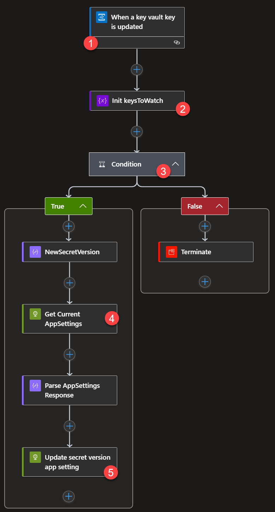

# Handling KeyVault secret rotation changes utilized by an Azure Function

This sample showcases one way to handle when a KeyVault secret used by your Azure Function is "rolled" or updated as part of normal security operations in your organizations.

Typically, organizations require that any secrets, keys, etc are stored in KeyVault and rotated either on-demand (in event of a breach) or as part of routing policy.

In these cases, your Azure Function may also be using these KeyVault secrets, in particular via <a href="https://docs.microsoft.com/en-us/azure/app-service/app-service-key-vault-references" target="_blank">App Setting KeyVault References</a>. In this scenario, the Azure Function must be told to "re-fetch" the value of the KeyVault secret to get the updated value. In this sample you'll learn how this can be done using a combination of Event Grid and Logic Apps.

## The approach

- When a KeyVault secret is updated, it emits a `NewSecretVersion` event to subscribers of the <a href="https://docs.microsoft.com/en-us/azure/event-grid/event-schema-key-vault" target="_blank">Key Vault's Event Grid messages</a>.
- To field these messages, Logic Apps can be connected as a subscriber to the KeyVault instance, and even filter for this message type.
- Azure Functions' <a href="https://docs.microsoft.com/en-us/rest/api/appservice/WebApps/Restart#uri-parameters" target="_blank">REST API allows for a `soft-restart` command</a> which forces Configuration Values to be reloaded; this causes the KeyVault reference to be re-evaluated and the new value of the secret to be reflected in the Function's runtime.

## The Implementation

In this sample, we deploy two different Application Insights instances. The first instance's Instrumentation Key is put into a KeyVault secret and the Azure Function uses a KeyVault reference to it as the `APPINSIGHTS_INSTRUMENTATIONKEY` application setting. The Azure Function's binding is a Timer Trigger which executes every ~5 seconds and simply posts a message with the current UTC time to the Application Insights instance to which it's talking.

When we change the value of the KeyVault secret to the second Application Insights instance's Instrumentation Key, you'll see the event get fired to the Logic App, and the Logic App will issue the soft-restart request to the Azure Function. By having the Live Stream tab for both Application Insights instances open at the same time, you can see one cease to receive message while the other begins to receive them. This completes the sequence of events triggered by simply changing the secret value in KeyVault.

## Deploying the sample

The deployment of this sample utilizes <a href="https://terraform.io" target="_blank">Terraform</a>, and comes ready-made with a <a href="https://code.visualstudio.com/docs/remote/containers" target="_blank">Visual Studio Code DevContainer</a> to ensure you have everything you need to do the deployment. If this is your first time utilizing a Dev Container, be sure to walk through <a href="https://code.visualstudio.com/docs/remote/containers#_installation" target="_blank">the installation steps</a> to ensure you have everything you need.

### 1. Clone the repo

Clone this repo, or your own fork of it, to your local machine.

### 2. Open the workspace in its container

When prompted by Visual Studio Code, Reopen the workspace in its Dev Container. This may take a few minutes to install all of the container layers and get you to a bash prompt. Make sure you have Docker running ;)

### 3. Login to the Azure CLI

In the bash terminal of VS Code, issue the `az login` command and `az account set --subscription <your subscription id>` commands to log in to Azure and target the subscription into which you wish to deploy the sample.

### 4. Create a Service Principal

To make deployment of the Logic App completely hands-off, and enable it to authenticate with Event Grid without an OAuth flow, you'll create a service principal on your Azure Subscription by issuing the `az ad sp create-for-rbac` command. When this completes, you'll get output that looks like this:

```json
{
    "appId": "...",
    "displayName": "...",
    "name": "...",
    "password": "...",
    "tenant": "..."
}
```

Save the `appId` and `password` fields of this output for the next step

### 5. Deploy via Terraform

In the terminal window of VSCode issue the following commands:

```sh
cd terraform
terraform init
terraform apply -var prefix=<a unique prefix for you> -var sp_client_id=<appId from above> -var sp_client_secret=<password from above>
```

This will first output all the changes that will be made to your Azure Subscription as part of Terraform's deployment, and wait for you to type 'yes' for the application to take place. For this sample, the following resources are deployed:

- A new Resource Group named `serverless-sample-<prefix>' containing:
- Logic Apps API Connection to Event Grid
- 2 Application Insights Instances
- Key Vault
- Consumption App Service plan
- Azure Function
- Logic App
- Log Analytics Workspace
- Storage Account

Type 'yes' and Terraform will work its magic.

### 6. Add the App Setting for the Application Insights KeyVault secret to the Function App

An output from the Terraform is a deployment script you must run in order to populate the Function App's application setting for Application Insights as well as actually deploy the Function code. In your VSCode bash terminal window, simply run

```
./deploy_app.sh
```

from the `terraform/` directory you're in after running `terraform apply`.

> Note: We can't set the APPINSIGHTS_INSTRUMENTATIONKEY value via Terraform (yet) because it will erase all other App Settings if we deploy via ARM template, and there's a race condition between the Function App and they KeyVault if we try to embed it as part of the Function App's deployment. In a production scenario this would be done as part of the DevOps pipeline being used to execute the Terraform plan. Likewise, the DevOps pipeline would build & deploy the Function App.

### 7. Observe the outcome

#### The Azure Function

In your portal, go to the newly-created Azure Function. Its name will be the `<prefix>-serverless-functionapp` value you put in during the Terraform deployment.

There are a few things to notice:

1. The Function app has one Function: `Timer5sec`


2. Under `Configuration` you'll find the Application Setting KeyVault reference for `APPINSIGHTS_INSTRUMENTATIONKEY`


> Note: It's important to note the **lack** of a secret version specifier in the URL. By using this method, we always retrieve the latest version of the secret, enabling the behavior we want. Alternatively, you could create a process that *updates* the `APPINSIGHTS_INSTRUMENTATIONKEY` app setting with the URL which comes through as part of the Event Grid event for `NewSecretVersion`.

> Notice the `Status` marker on the reference; this tells you the connection between the Function App and KeyVault is all good, and it's able to pull the value from KeyVault as intended

3. In the IAM (Access Control) area of the Function App, under Role Assignments, you'll find an entry for the Logic App.


This exists to give the Logic App necessary permissions to issue the soft-reset request to the Function App. Without it, the Azure REST API request made by the Logic App receives a `403 FORBIDDEN` response.

The link between the Logic App and the Azure Function is made by this part in [main.tf](terraform/main.tf):

```hcl
##################################################################################
# Role Assignment
##################################################################################
resource "azurerm_role_assignment" "laToFunction" {
  scope                = azurerm_function_app.fxn.id
  role_definition_name = "Website Contributor"
  principal_id         = azurerm_template_deployment.logicapp.outputs["logicAppServicePrincipalId"]
}
```

and the fact that the Logic App was created with a Managed Service Identity assigned to it as part of its ARM template deployment:

```json
"identity": {
    "type": "SystemAssigned"
},
```

4. The Function App itself has a Managed Service Identity:


This is part of setting up the Azure Function to use KeyVault references, and enables KeyVault to restrict access to keys, secrets, and other things to only certain identities. This access is applied by this part of our Terraform deployment:

```hcl
  # access policy for azure function
  access_policy {
    object_id = azurerm_function_app.fxn.identity[0].principal_id
    tenant_id = data.azurerm_client_config.current.tenant_id

    secret_permissions = [
      "get",
    ]
  }
```

which ensures that even if somebody were to submit Function code that attempted to change a value in the KeyVault, it would not be allowed; the Function has only "Get Secret" permissions, which is all it needs.

#### The Logic App

In your portal, go to the newly-created Logic App. Its name will be `<prefix>-serverless-la` where `<prefix>` is the value you put in during the Terraform deployment.

##### Execution Logic

Click `Logic App Designer` in the left-hand portion of the blade so you can see the design surface for the Logic App.

Clicking on the titlebar of each block in the Logic App will expand out its contents to look like this:



Let's examine each block of Logic.

1. This block wires up the *trigger* of the Logic App. When we create this via the ARM Template Deployment in Terraform, it automatically requests an Event Grid subscription from the resource denoted in `Resource Name` and listens for the event type denoted in `Event Type Item - 1`. The Logic App trigger takes care of the Event Grid Subscription Validation event so everything is able to communicate without issue.

2. As part of our Terraform, we populate the value of this Logic App variable with the secret names we put in to KeyVault.

3. We use this 'if' statement (aka Condition block) to say "if the subject of the event we got (which corresponds to the name of the secret that fired the `NewSecretVersion` event) is in our `keysToWatch` array variable" so we can ignore changes to other secrets in the same vault.

4. Here we use the Azure REST API to invoke the `softRestart` of the Function App we created.

5. The authentication of the previous request comes from the Managed Identity we've assigned the Logic App, and the User Access role pointed out earlier which has `Website Contributor` access to the Function App. If that User Access Role is missing, this block of the Logic App will fail.

##### Configuration

The important part of the Logic App's configuration is that our Terraform deployment assigned it a Managed Identity. You can see this in the `Identity` area of the Logic App:


#### Key Vault

In your portal, go to the newly-created Key Vault. Its name will be the `<prefix>-serverless-kv` value you put in during the Terraform deployment.

The important bits of the Key Vault for this sample are the `Events` and `Access Policies` area

##### Events configuration

Earlier, you saw the Logic App Event Grid trigger configured to receive events from the Key Vault resource. When Logic App is deployed with this connector in place, it automatically creates the Event Grid subscription from the Key Vault instance. Click the `Events` area of your KeyVault and notice the `Subscriptions` area near the bottom:


Here you see the Logic App registered itself as a webhook receiver for events from the KeyVault.

##### Access Policies

In order for the Function App to be able to read the values of Key Vault secrets, you remember, our Terraform granted it this permission in the configuration of the KeyVault. You can see this in the Access Policies area:


## Bringing it all together

If you open the Live Stream for the first Application Insights instance (with the `-first` suffix) you'll see the Function happily logging messages every 5 seconds or so:


Moving over to the secondary Application Insights (with the `-second` suffix), you'll probably see a screen like this:


But if you take the Instrumentation Key from the secondary instance and update the KeyVault secret `appinsights-instrumentationkey` with it, you'll see that behavior flip as the event propagates through the system and the Function App is soft-reset to pick up the new value from KeyVault!
